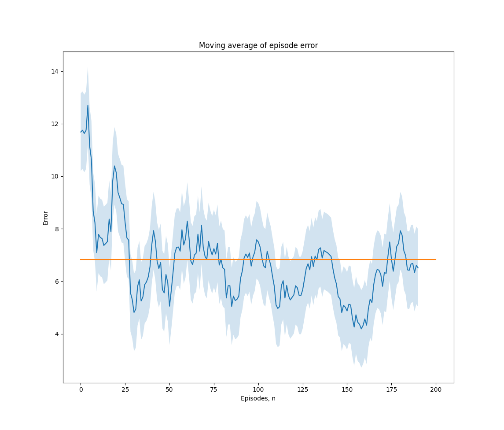

# LIMIT: Learning Interfaces to Maximize Information Transfer

This is a repository for our paper, ["LIMIT: Learning Interfaces to Maximize Information Transfer"](https://collab.me.vt.edu/pdfs/ben_thri2023.pdf). We include:

- Implementation of **LIMIT**
- Custom 2D ("Lights") environment to test **LIMIT** with an *Align* Human (see our paper for more information)

## Requirements

Requirements are listed in `requirements.txt`:

- python3
- pytorch $\ge$ 1.12.1
- numpy $\ge$ 1.24.2
- matplotlib $\ge$ 3.7.1 
- scipy $\ge$ 1.9.3

Requirements can be installed using pip:

`pip install -r requirements.txt`

## Instructions

To run a demonstration of **LIMIT**, run `python main.py`. **LIMIT** will train with the *Align* human, and the result should be similar to the plot below:

You can also provide arguments to adjust the behavior of **LIMIT**:

- `--episodes`: change the number of episodes that AlignHuman uses **LIMIT**. Default is 200
- `--online`: passing this flag enables **LIMIT** to learn online. Since AlignHuman updates *after* each interaction, do not an expect a significant performance boost from this. When interacting with real humans, **LIMIT** performs better when it learns online.

